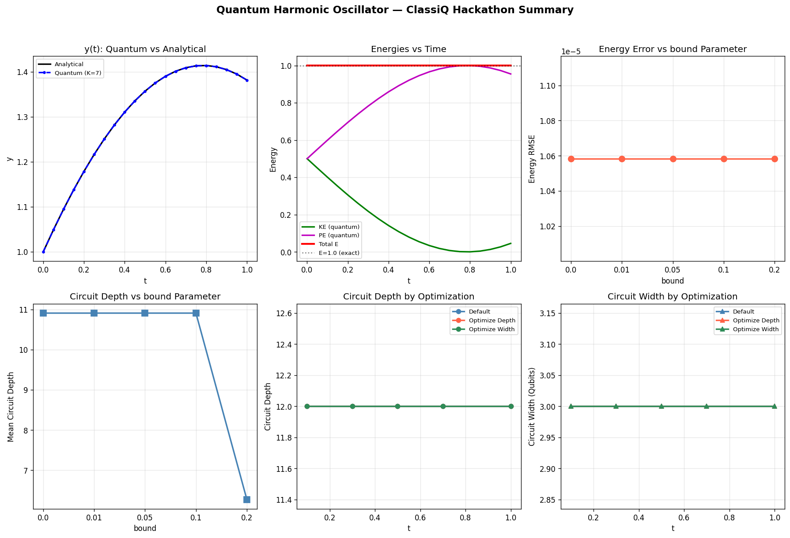

# Quantum Harmonic Oscillator — ClassiQ Hackathon

A quantum algorithm implementation for solving the harmonic oscillator differential equation using the **Classiq SDK**, based on the paper:

> **"A Quantum Algorithm for Solving Linear Differential Equations: Theory and Experiment"**  
> Tao Xin et al., *Physical Review A* **101**, 032307 (2020)

## Problem

We solve the quantum harmonic oscillator equation:

$$y'' + \omega^2 y = 0, \quad y(0) = 1, \quad y'(0) = 1, \quad \omega = 1$$

## Algorithm

The implementation uses the **Taylor Expansion + Linear Combination of Unitaries (LCU)** approach from the paper:

1. **Convert** the second-order ODE to a first-order system: $d\mathbf{x}/dt = M\mathbf{x}$
2. **Taylor expand** the matrix exponential: $e^{Mt} \approx \sum_{m=0}^{K} \frac{(Mt)^m}{m!}$ with $K = 7$
3. **Encode** the Taylor coefficients as a quantum state using Classiq's `inplace_prepare_state()` on a 3-qubit index register
4. **Execute** on the Classiq simulator and verify the state preparation
5. **Reconstruct** the solution $\mathbf{x}(t) = [y(t), y'(t)]$ and compute energies

## Results

| Metric | Value |
|--------|-------|
| Taylor order K | 7 (8 terms on 3 qubits) |
| Max solution error vs analytical | ~10⁻⁷ |
| Total energy conservation | E = 1.0 ± 10⁻⁵ |
| Circuit depth (exact, bound=0) | ~11–12 gates |
| Circuit depth (relaxed, bound=0.2) | ~6–7 gates (~40% reduction) |

### Summary Figure



## Deliverables

- [x] **Quantum program** solving the harmonic oscillator using the paper's LDE algorithm
- [x] **Energy analysis**: Kinetic and potential energy as functions of time
- [x] **Parameter investigation**: Effect of `bound` in `inplace_prepare_state()` on accuracy vs circuit depth
- [x] **Circuit optimization**: Depth and width under `'depth'` vs `'width'` optimization settings

## Setup

### Prerequisites
- Python 3.10+
- A free [Classiq](https://platform.classiq.io) account

### Installation

```bash
# Create virtual environment
python -m venv .venv

# Activate (Windows)
.venv\Scripts\activate

# Install dependencies
pip install classiq matplotlib scipy ipykernel
```

### Running

1. Open `harmonic_oscillator_quantum.ipynb` in Jupyter
2. Select the `.venv` kernel
3. Run the authentication cell (`classiq.authenticate()`) — a browser will open for OAuth login
4. Run all cells in order (Sections 5 & 6 take a few minutes due to multiple circuit synthesis calls)

## Key Findings

1. **The quantum LDE algorithm works**: Taylor-LCU correctly solves the harmonic oscillator with near-machine-precision accuracy at K=7.

2. **`inplace_prepare_state` is the key subroutine**: It maps classical Taylor coefficients to quantum amplitudes, enabling the LCU superposition encoding the matrix exponential.

3. **The `bound` parameter offers a clear resource tradeoff**: Increasing `bound` from 0 to 0.2 reduces circuit depth by ~40%, with negligible impact on solution accuracy for this problem size.

4. **Optimization settings have limited effect at small scale**: For a 3-qubit circuit, `'depth'` vs `'width'` optimization yields similar circuits. The tradeoff becomes meaningful for larger quantum programs.

## Tech Stack

- **[Classiq SDK](https://www.classiq.io/)** v1.3.0 — quantum circuit synthesis and execution
- **NumPy** — numerical computation
- **SciPy** — classical ODE reference solution
- **Matplotlib** — visualization

## Reference

Tao Xin, Shijie Wei, Jianlian Cui, Junxiang Xiao, et al., *"A Quantum Algorithm for Solving Linear Differential Equations: Theory and Experiment"*, Phys. Rev. A **101**, 032307 (2020)
